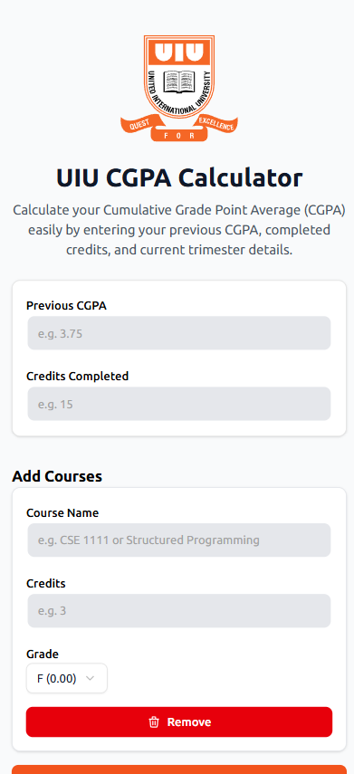
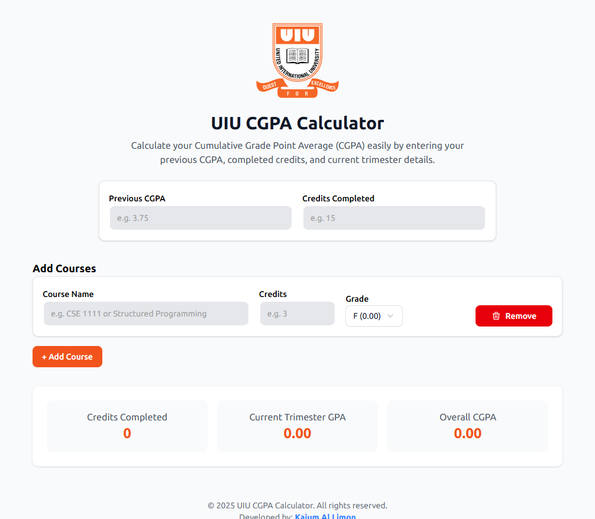
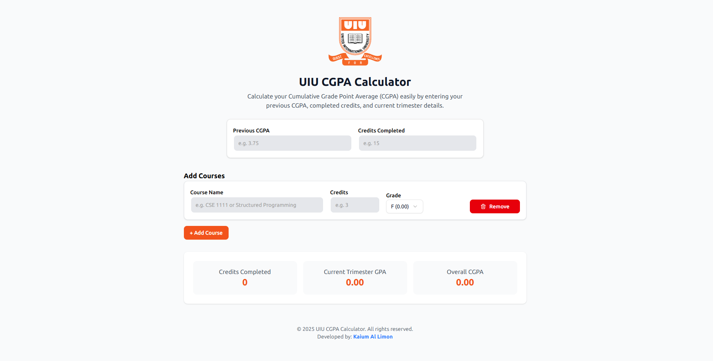

# UIU CGPA Calculator

A modern, user-friendly CGPA (Cumulative Grade Point Average) calculator built specifically for United International University students. This web application helps students easily calculate their semester and cumulative GPA with a clean, intuitive interface.

## Features

- 📊 Calculate Semester GPA with multiple courses
- 🔄 Calculate Cumulative GPA with previous records
- ➕ Dynamically add/remove courses
- 💾 Real-time calculations
- 🎨 Modern and responsive UI
- ✨ Smooth animations with Framer Motion
- 📱 Mobile-friendly design

## Tech Stack

- **Framework:** Next.js 16
- **UI Components:** 
  - Radix UI primitives
  - Custom UI components with Tailwind CSS
- **Styling:** Tailwind CSS
- **Animations:** Framer Motion
- **Icons:** Tabler Icons

## Preview

The CGPA Calculator provides an intuitive interface where you can:
- Enter your previous CGPA and completed credits
- Add multiple courses with their credits and grades
- Get instant calculation of your new CGPA
- Easily remove courses with a single click
- View your semester GPA separately

### Screenshots for various screens

## Contributing

Feel free to open issues and pull requests for any improvements you think would make the calculator better!

## License

This project is licensed under the MIT License - see the [LICENSE](LICENSE) file for details.
